# House Sales in King County, USA


## 데이터 소개

This dataset contains house sale prices for King County, which includes Seattle.<br>
It includes homes sold between May 2014 and May 2015.<br>
The dataset consists of 19 house features plus the price and the id columns, along with 21613 observations.


```python
import pandas as pd
pd.set_option('display.max_columns', None)

house = pd.read_csv('kc_house_data.csv')
print(house.shape)
house.head(3)
```


<div>
<style scoped>
    .dataframe tbody tr th:only-of-type {
        vertical-align: middle;
    }

    .dataframe tbody tr th {
        vertical-align: top;
    }

    .dataframe thead th {
        text-align: right;
    }
</style>
<table border="1" class="dataframe">
  <thead>
    <tr style="text-align: right;">
      <th></th>
      <th>id</th>
      <th>date</th>
      <th>price</th>
      <th>bedrooms</th>
      <th>bathrooms</th>
      <th>sqft_living</th>
      <th>sqft_lot</th>
      <th>floors</th>
      <th>waterfront</th>
      <th>view</th>
      <th>condition</th>
      <th>grade</th>
      <th>sqft_above</th>
      <th>sqft_basement</th>
      <th>yr_built</th>
      <th>yr_renovated</th>
      <th>zipcode</th>
      <th>lat</th>
      <th>long</th>
      <th>sqft_living15</th>
      <th>sqft_lot15</th>
    </tr>
  </thead>
  <tbody>
    <tr>
      <th>0</th>
      <td>7129300520</td>
      <td>20141013T000000</td>
      <td>221900.0</td>
      <td>3</td>
      <td>1.00</td>
      <td>1180</td>
      <td>5650</td>
      <td>1.0</td>
      <td>0</td>
      <td>0</td>
      <td>3</td>
      <td>7</td>
      <td>1180</td>
      <td>0</td>
      <td>1955</td>
      <td>0</td>
      <td>98178</td>
      <td>47.5112</td>
      <td>-122.257</td>
      <td>1340</td>
      <td>5650</td>
    </tr>
    <tr>
      <th>1</th>
      <td>6414100192</td>
      <td>20141209T000000</td>
      <td>538000.0</td>
      <td>3</td>
      <td>2.25</td>
      <td>2570</td>
      <td>7242</td>
      <td>2.0</td>
      <td>0</td>
      <td>0</td>
      <td>3</td>
      <td>7</td>
      <td>2170</td>
      <td>400</td>
      <td>1951</td>
      <td>1991</td>
      <td>98125</td>
      <td>47.7210</td>
      <td>-122.319</td>
      <td>1690</td>
      <td>7639</td>
    </tr>
    <tr>
      <th>2</th>
      <td>5631500400</td>
      <td>20150225T000000</td>
      <td>180000.0</td>
      <td>2</td>
      <td>1.00</td>
      <td>770</td>
      <td>10000</td>
      <td>1.0</td>
      <td>0</td>
      <td>0</td>
      <td>3</td>
      <td>6</td>
      <td>770</td>
      <td>0</td>
      <td>1933</td>
      <td>0</td>
      <td>98028</td>
      <td>47.7379</td>
      <td>-122.233</td>
      <td>2720</td>
      <td>8062</td>
    </tr>
  </tbody>
</table>
</div>


### 컬럼 설명
* id - Unique ID for each home sold
* date - Date of the home sale
* price - Price of each home sold
* bedrooms - Number of bedrooms
* bathrooms - Number of bathrooms
* sqft_living - Square footage of the apartments interior living space
* sqft_lot - Square footage of the land space
* floors - Number of floors
* waterfront - A dummy variable for whether the apartment was overlooking the waterfront or not
* view - An index from 0 to 4 of how good the view of the property was
* condition - An index from 1 to 5 on the condition of the apartment
* grade - An index from 1 to 13, where 1-3 falls short of building construction and design, 7 has an average level of construction and design, and 11-13 have a high quality level of construction and design
* sqft_above - The square footage of the interior housing space that is above ground level
* sqft_basement - The square footage of the interior housing space that is below ground level
* yr_built - The year the house was initially built
* yr_renovated - The year of the house's last renovation
* zipcode - What zipcode area the house is in
* lat - Latitude
* long - Longitude
* sqft_living15 - The square footage of interior housing living space for the nearest 15 neighbors
* sqft_lot15 - The square footage of the land lots of the nearest 15 neighbors

***

### null값 및 데이터 타입 확인


```python
house.agg(["count", "dtype"])
```


<div>
<style scoped>
    .dataframe tbody tr th:only-of-type {
        vertical-align: middle;
    }

    .dataframe tbody tr th {
        vertical-align: top;
    }

    .dataframe thead th {
        text-align: right;
    }
</style>
<table border="1" class="dataframe">
  <thead>
    <tr style="text-align: right;">
      <th></th>
      <th>id</th>
      <th>date</th>
      <th>price</th>
      <th>bedrooms</th>
      <th>bathrooms</th>
      <th>sqft_living</th>
      <th>sqft_lot</th>
      <th>floors</th>
      <th>waterfront</th>
      <th>view</th>
      <th>condition</th>
      <th>grade</th>
      <th>sqft_above</th>
      <th>sqft_basement</th>
      <th>yr_built</th>
      <th>yr_renovated</th>
      <th>zipcode</th>
      <th>lat</th>
      <th>long</th>
      <th>sqft_living15</th>
      <th>sqft_lot15</th>
    </tr>
  </thead>
  <tbody>
    <tr>
      <th>count</th>
      <td>21613</td>
      <td>21613</td>
      <td>21613</td>
      <td>21613</td>
      <td>21613</td>
      <td>21613</td>
      <td>21613</td>
      <td>21613</td>
      <td>21613</td>
      <td>21613</td>
      <td>21613</td>
      <td>21613</td>
      <td>21613</td>
      <td>21613</td>
      <td>21613</td>
      <td>21613</td>
      <td>21613</td>
      <td>21613</td>
      <td>21613</td>
      <td>21613</td>
      <td>21613</td>
    </tr>
    <tr>
      <th>dtype</th>
      <td>int64</td>
      <td>object</td>
      <td>float64</td>
      <td>int64</td>
      <td>float64</td>
      <td>int64</td>
      <td>int64</td>
      <td>float64</td>
      <td>int64</td>
      <td>int64</td>
      <td>int64</td>
      <td>int64</td>
      <td>int64</td>
      <td>int64</td>
      <td>int64</td>
      <td>int64</td>
      <td>int64</td>
      <td>float64</td>
      <td>float64</td>
      <td>int64</td>
      <td>int64</td>
    </tr>
  </tbody>
</table>
</div>


#### 1. null값이 없는 것으로 확인된다


```python
tmp = house.agg(["count", "dtype"]).T
tmp['count'].unique()
```


    array([21613], dtype=object)


#### 2. 데이터타입이 상식밖에 있는 것은 없는지


```python
tmp['col'] = tmp.index
tmp.drop(["count"], axis = 1, inplace = True)

tmp = tmp.groupby('dtype')
```


```python
for key, item in tmp:
    print(tmp.get_group(key), "\n\n")
```

                   dtype            col
    id             int64             id
    bedrooms       int64       bedrooms
    sqft_living    int64    sqft_living
    sqft_lot       int64       sqft_lot
    waterfront     int64     waterfront
    view           int64           view
    condition      int64      condition
    grade          int64          grade
    sqft_above     int64     sqft_above
    sqft_basement  int64  sqft_basement
    yr_built       int64       yr_built
    yr_renovated   int64   yr_renovated
    zipcode        int64        zipcode
    sqft_living15  int64  sqft_living15
    sqft_lot15     int64     sqft_lot15 
    
    
                 dtype        col
    price      float64      price
    bathrooms  float64  bathrooms
    floors     float64     floors
    lat        float64        lat
    long       float64       long 
    
    
           dtype   col
    date  object  date 
    
    
    

#### `bathrooms`와 `floors`의 데이터 타입이 float인 이유:
1. `bathrooms` count 기준: Full bathrooms (ensuite) = 1, Half bathrooms (separate)= 0.5, Powder rooms (only toilet and sink) = 0.25 
2. `floors`에는 mezzanine(중이층)구조가 .5로 나타난다 

***

## EDA

### About King County, USA

주요 도시 한 눈에 확인하기


```python
upper_lat = house.sort_values(by=['price'], ascending = False)['lat'][:int(len(house)/3)]
upper_lon = house.sort_values(by=['price'], ascending = False)['long'][:int(len(house)/3)]
middle_lat = house.sort_values(by=['price'], ascending = False)['lat'][int(len(house)/3):int(len(house)*2/3)]
middle_lon = house.sort_values(by=['price'], ascending = False)['long'][int(len(house)/3):int(len(house)*2/3)]
lower_lat = house.sort_values(by=['price'], ascending = False)['lat'][int(len(house)*2/3):]
lower_lon = house.sort_values(by=['price'], ascending = False)['long'][int(len(house)*2/3):]
```


```python
from bokeh.models import ColumnDataSource, GMapOptions, Toggle,  BoxSelectTool
from bokeh.plotting import gmap
from bokeh.io import output_file, show
from bokeh.layouts import layout
```


```python
map_options = GMapOptions(lat=house.lat.mean(), lng=house.long.mean()+0.1, map_type="terrain", zoom=10)

p = gmap(key, map_options, title="King County Map with 3 classes")
p.plot_height = 500
p.plot_width = 980

source1 = ColumnDataSource( data=dict(lat=upper_lat, lon=upper_lon))
upper = p.circle(x="lon", y="lat", size=3, fill_color="red", fill_alpha=0.9, source=source1, line_width = 0)
p.add_layout(upper)
toggle1 = Toggle(label="Upper", button_type="warning", active=True)
toggle1.js_link('active', upper, 'visible')


source2 = ColumnDataSource( data=dict(lat=middle_lat, lon=middle_lon))
togle_middle = p.circle(x="lon", y="lat", size=3, fill_color="darkturquoise", fill_alpha=0.9, source=source2, line_width = 0)
p.add_layout(togle_middle)
toggle_middle = Toggle(label="Middle", button_type="default", active=True)
toggle_middle.js_link('active', togle_middle, 'visible')


source3 = ColumnDataSource( data=dict(lat=lower_lat, lon=lower_lon))
togle_lower = p.circle(x="lon", y="lat", size=3, fill_color="darkblue", fill_alpha=0.9, source=source3, line_width = 0)
p.add_layout(togle_lower)
toggle_lower = Toggle(label="Lower", button_type="primary", active=True)
toggle_lower.js_link('active', togle_lower, 'visible')

p.add_tools(BoxSelectTool())

output_file('3classes.html')
show(layout([p], [toggle1, toggle_middle, toggle_lower]))
```

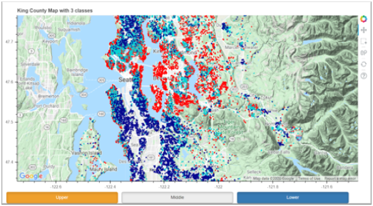

#### 주요도시
1. Seattle : 핵심도시
2. Medina : 부촌 (빌게이츠/ 제프 베조스(아마존 창업자) 대저택으로 유명)
3. Bellevue : 시애틀대교 건설 후, 위성도시 → 대도시 팽창
4. Mercer Island / Redmond : 대도시, 교육도시, 일부 부촌

### Which is the most common house?

### `price`(거래가격) 기준


```python
import seaborn as sns
import matplotlib.pyplot as plt
```


```python
sns.set(style="white",rc={'figure.figsize':(9,6)})
sns.boxplot('price',data=house)
plt.show()
```


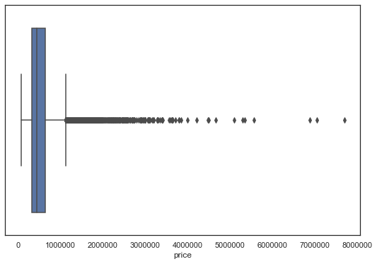


```python
print('평균 주택 거래가격  : $',house['price'].mean())
print('주택 거래가격 중위값: $',house['price'].median())
```

    평균 주택 거래가격  : $ 540182.1587933188
    주택 거래가격 중위값: $ 450000.0
    

### `bedrooms`(침실개수) 기준


```python
from matplotlib import font_manager, rc, rcParams
def set_korea_font():
    font_name = font_manager.FontProperties(fname="c:/Windows/Fonts/malgun.ttf").get_name()
    rc('font', family=font_name)
    rcParams.update({'font.size': 11})
    rcParams['axes.unicode_minus'] = False  
set_korea_font()
```


```python
set_korea_font()
house['bedrooms'].value_counts().sort_index().plot(kind='bar',figsize=(9,6))
plt.title('침실개수에 따른 주택거래수')
plt.xlabel('침실개수')
plt.ylabel('거래된주택수')
```


    Text(0, 0.5, '거래된주택수')


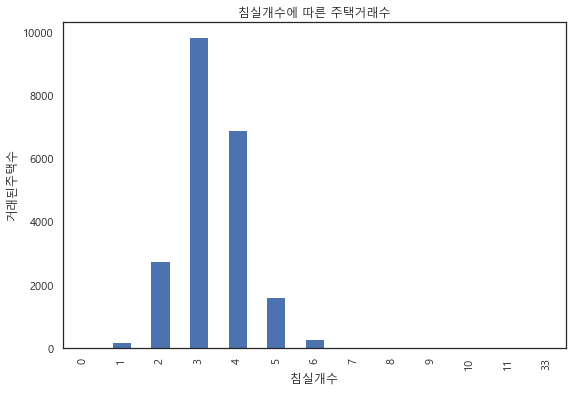


침실 개수가 3,4개인 집이 가장 많이 팔렸다.<br>
침실 개수가 33개인 outlier가 존재한다.

#### 이상치 확인


```python
bed_out = house[house['bedrooms']==33]
bed_out
```


<div>
<style scoped>
    .dataframe tbody tr th:only-of-type {
        vertical-align: middle;
    }

    .dataframe tbody tr th {
        vertical-align: top;
    }

    .dataframe thead th {
        text-align: right;
    }
</style>
<table border="1" class="dataframe">
  <thead>
    <tr style="text-align: right;">
      <th></th>
      <th>id</th>
      <th>date</th>
      <th>price</th>
      <th>bedrooms</th>
      <th>bathrooms</th>
      <th>sqft_living</th>
      <th>sqft_lot</th>
      <th>floors</th>
      <th>waterfront</th>
      <th>view</th>
      <th>condition</th>
      <th>grade</th>
      <th>sqft_above</th>
      <th>sqft_basement</th>
      <th>yr_built</th>
      <th>yr_renovated</th>
      <th>zipcode</th>
      <th>lat</th>
      <th>long</th>
      <th>sqft_living15</th>
      <th>sqft_lot15</th>
    </tr>
  </thead>
  <tbody>
    <tr>
      <th>15870</th>
      <td>2402100895</td>
      <td>20140625T000000</td>
      <td>640000.0</td>
      <td>33</td>
      <td>1.75</td>
      <td>1620</td>
      <td>6000</td>
      <td>1.0</td>
      <td>0</td>
      <td>0</td>
      <td>5</td>
      <td>7</td>
      <td>1040</td>
      <td>580</td>
      <td>1947</td>
      <td>0</td>
      <td>98103</td>
      <td>47.6878</td>
      <td>-122.331</td>
      <td>1330</td>
      <td>4700</td>
    </tr>
  </tbody>
</table>
</div>


침실 개수가 33개인 주택이 하나 존재한다.

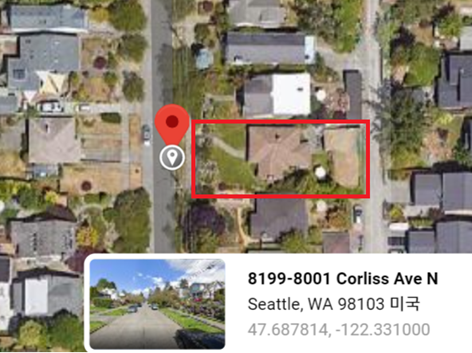

데이터상 `sqft_living`(평수)가 다른 값들에 비해 두드러지게 크지 않고, 지도상으로도 평범한 단독주택으로 보이므로 입력 오류일 가능성이 크다

#### 이상치 제거


```python
house = house[house['bedrooms']!=33]
sorted(house['bedrooms'].unique())
```


    [0, 1, 2, 3, 4, 5, 6, 7, 8, 9, 10, 11]


### 위치 기준


```python
plt.figure(figsize=(20,10))
sns.jointplot(x=house.long.values,y=house.lat.values)
plt.xlabel('경도',fontsize=12)
plt.ylabel('위도',fontsize=12)
plt.show()
```


    <Figure size 1440x720 with 0 Axes>


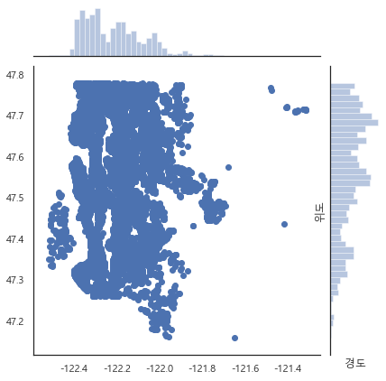


```python
plt.figure(figsize=(20,10))
sns.kdeplot(data=house.long.values,data2=house.lat.values,cmap='RdBu')
plt.xlabel('경도',fontsize=12)
plt.ylabel('위도',fontsize=12)
plt.show()
```


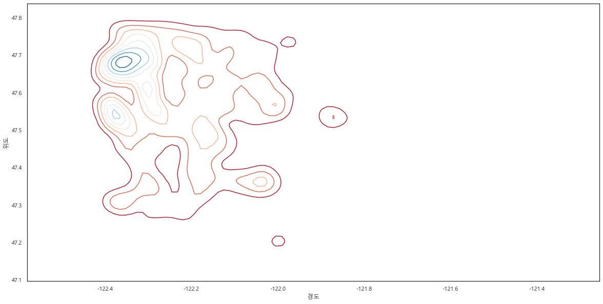


위도 47,7-47.8, 경도 122.2-122.4 사이에 위치한 주택의 거래수가 많다.

### `condition`과 `grade`(건물상태평가) 기준


```python
fig = plt.figure(figsize=(12,6))
ax1 = fig.add_subplot(121)
ax2 = fig.add_subplot(122)

sns.factorplot(x='condition',data=house,kind='count',ax=ax1)
plt.close()
sns.factorplot(x='grade',data=house,kind='count',ax=ax2)
plt.close()

plt.show()
```

    C:\Users\13Z970-G.AR30K\Anaconda3\lib\site-packages\seaborn\categorical.py:3666: UserWarning: The `factorplot` function has been renamed to `catplot`. The original name will be removed in a future release. Please update your code. Note that the default `kind` in `factorplot` (`'point'`) has changed `'strip'` in `catplot`.
      warnings.warn(msg)
    


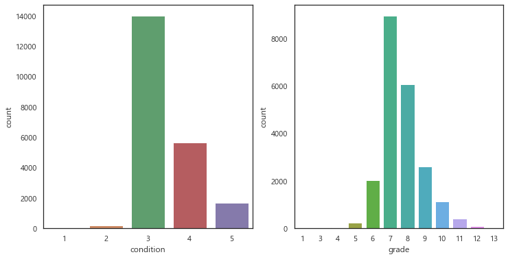


건물상태 측정에서 중간 정도의 평가를 받은 주택의 거래수가 가장 많았다.

### `view`(경치) 기준


```python
sns.factorplot(x='view',data=house,kind='count')
plt.show()
```


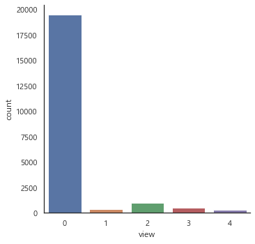


```python
print('view가 0인 주택의 비율: {:0.3f}'.format(len(house[house['view'].values == 0])/len(house)))
```

    view가 0인 주택의 비율: 0.902
    

전체 거래된 주택 중 90% 이상 주택의 view 값이 0이다.

### `yr_built`(시공연도) 기준


```python
house.hist(column='yr_built',bins=116,grid=False,figsize=(9,6))
```


    array([[<matplotlib.axes._subplots.AxesSubplot object at 0x0000026B6325F4A8>]],
          dtype=object)


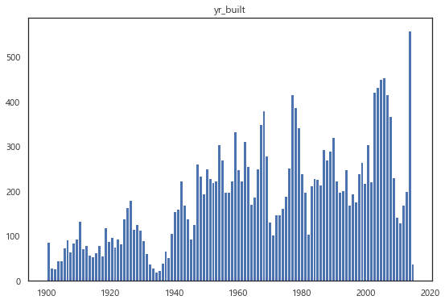


대체적으로 최근에 시공한 주택일수록 그 거래수가 많다.<br>
특히 2014년에 시공한 주택이 가장 많이 거래되었는데, 본 자료가 2014년 3월부터 2015년 3월까지의 거래정보임을 감안하였을 때,<br>
당해년도 완공하여 곧바로 분양된 주택이 시장에서 가장 잘 팔렸던 것을 확인할 수 있다.

### `yr_renovated`(리모델링연도) 기준


```python
house.hist(column='yr_renovated',bins=116,grid=False,figsize=(9,6))
```


    array([[<matplotlib.axes._subplots.AxesSubplot object at 0x0000026B6482BDD8>]],
          dtype=object)


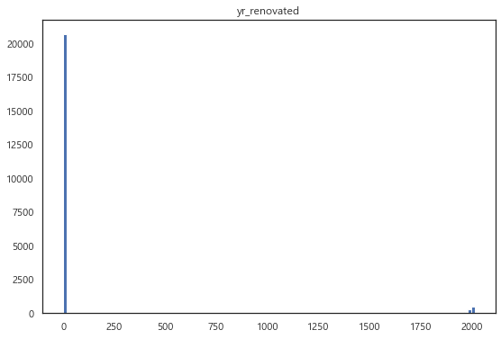


```python
print('yr_renovated가 0인 주택의 비율: {:0.3f}'.format(len(house[house['yr_renovated'].values == 0])/len(house)))
```

    yr_renovated가 0인 주택의 비율: 0.958
    

거래된 주택 중 리모델링을 하지 않은 주택이 대부분을 차지하는 것을 확인할 수 있다.

### 변수가 `price`(주택거래가격)에 미치는 영향

#### 주택거래가격과 변수간 상관관계


```python
features = house.iloc[:,3:].columns.tolist()
target = house.iloc[:,2].name
```


```python
correlations = dict()

from scipy.stats import pearsonr

for f in features:
    house_temp = house[[f,target]]
    x1 = house_temp[f].values
    x2 = house_temp[target].values
    key = f
    correlations[key] = pearsonr(x1,x2)[0]

house_corr = pd.DataFrame(correlations, index=['상관계수']).T
house_corr = house_corr.loc[house_corr['상관계수'].sort_values(ascending=False).index]
```


```python
set_korea_font()
house_corr.plot(kind='barh',figsize=(9,6))
plt.title('거래가격과 변수간 상관관계')
```


    Text(0.5, 1.0, '거래가격과 변수간 상관관계')


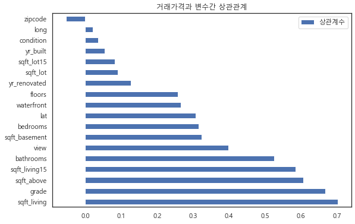


#### `sqft_living` , `sqft_living15` , `sqft_lot` , `sqft_lot15` , `sqft_above` , `sqft_basement`


```python
set_korea_font()
col_names1=['sqft_living', 'sqft_living15', 'sqft_lot', 'sqft_lot15','sqft_above','sqft_basement']

fig, axes = plt.subplots(3,2,figsize=(15,20))
fig.suptitle('변수가 거래가격에 미치는 영향',fontsize=20)
fig.tight_layout()
fig.subplots_adjust(top=0.93,wspace=0.3,hspace=0.3)

for ax, name in zip(axes.flatten(), col_names1):
    sns.scatterplot(x=name,y='price',data=house,ax=ax)

axes[0][0].set_title("주택 평수",fontdict={'fontsize': 18})
axes[0][1].set_title("인근 15개 주택의 평균 평수",fontdict={'fontsize': 18})
axes[1][0].set_title("부지 평수",fontdict={'fontsize': 18})
axes[1][1].set_title("인근 15개 부지의 평균 평수",fontdict={'fontsize': 18})
axes[2][0].set_title("주택의 지상 평수",fontdict={'fontsize': 18})
axes[2][1].set_title("주택의 지하 평수",fontdict={'fontsize': 18})

plt.show()
```


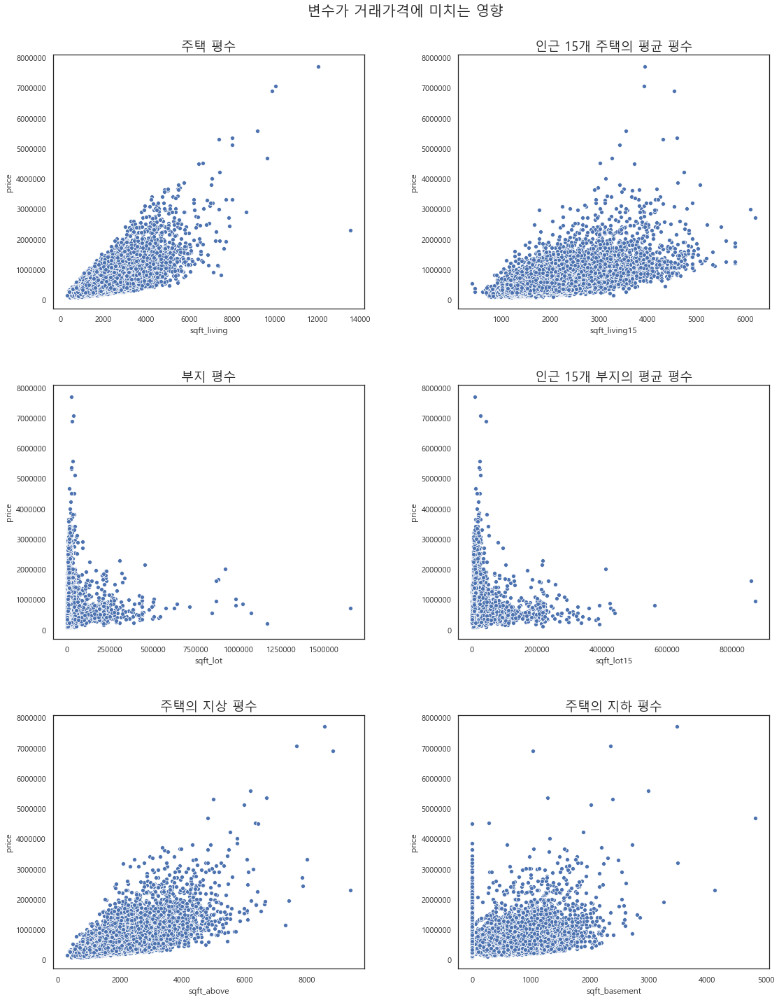


#### 이상치 확인

첫번째 그래프에서 주택 평수가 넓어짐에 따라 거래가격이 높아지는 경향을 확인할 수 있는데,<br>
예외적으로 가장 넓은 평수의 집이 상대적으로 낮은 거래가격을 가진다.


```python
house[house['sqft_living']==max(house['sqft_living'])]
```


<div>
<style scoped>
    .dataframe tbody tr th:only-of-type {
        vertical-align: middle;
    }

    .dataframe tbody tr th {
        vertical-align: top;
    }

    .dataframe thead th {
        text-align: right;
    }
</style>
<table border="1" class="dataframe">
  <thead>
    <tr style="text-align: right;">
      <th></th>
      <th>id</th>
      <th>date</th>
      <th>price</th>
      <th>bedrooms</th>
      <th>bathrooms</th>
      <th>sqft_living</th>
      <th>sqft_lot</th>
      <th>floors</th>
      <th>waterfront</th>
      <th>view</th>
      <th>condition</th>
      <th>grade</th>
      <th>sqft_above</th>
      <th>sqft_basement</th>
      <th>yr_built</th>
      <th>yr_renovated</th>
      <th>zipcode</th>
      <th>lat</th>
      <th>long</th>
      <th>sqft_living15</th>
      <th>sqft_lot15</th>
    </tr>
  </thead>
  <tbody>
    <tr>
      <th>12777</th>
      <td>1225069038</td>
      <td>20140505T000000</td>
      <td>2280000.0</td>
      <td>7</td>
      <td>8.0</td>
      <td>13540</td>
      <td>307752</td>
      <td>3.0</td>
      <td>0</td>
      <td>4</td>
      <td>3</td>
      <td>12</td>
      <td>9410</td>
      <td>4130</td>
      <td>1999</td>
      <td>0</td>
      <td>98053</td>
      <td>47.6675</td>
      <td>-121.986</td>
      <td>4850</td>
      <td>217800</td>
    </tr>
  </tbody>
</table>
</div>


확인 결과, 실내에 여러 대형 훈련시설을 구비한 승마 훈련장이므로 이상치를 제거하지 않았다.

#### `bedrooms` , `bathrooms` , `floors` , `grade` , `condition` , `view`


```python
set_korea_font()
col_names2=['bedrooms', 'bathrooms', 'floors', 'grade', 'condition', 'view']

fig, axes = plt.subplots(3,2,figsize=(15,20))
fig.suptitle('변수가 거래가격에 미치는 영향',fontsize=20)
fig.tight_layout()
fig.subplots_adjust(top=0.93,wspace=0.3,hspace=0.3)

for ax, name in zip(axes.flatten(), col_names2):
    sns.boxplot(x=name,y='price',data=house,ax=ax)

axes[0][0].set_title("침실",fontdict={'fontsize': 18})
axes[0][1].set_title("화장실",fontdict={'fontsize': 18})
axes[1][0].set_title("층수",fontdict={'fontsize': 18})
axes[1][1].set_title("Grade",fontdict={'fontsize': 18})
axes[2][0].set_title("Condition",fontdict={'fontsize': 18})
axes[2][1].set_title("경치",fontdict={'fontsize': 18})

plt.show()
```


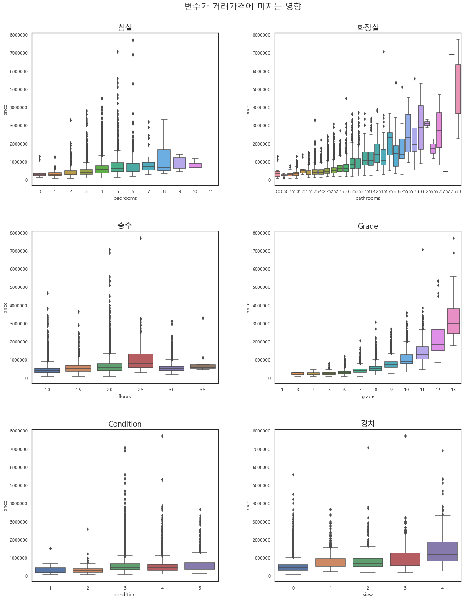


#### `waterfront`


```python
sns.boxplot(x='waterfront',y='price',hue='waterfront',data=house,dodge=False)
```


    <matplotlib.axes._subplots.AxesSubplot at 0x26b65180f60>


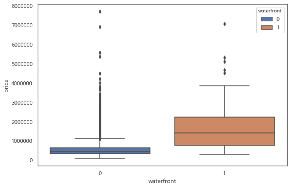


해안뷰를 가진 주택의 매매가격이 대체적으로 높다.

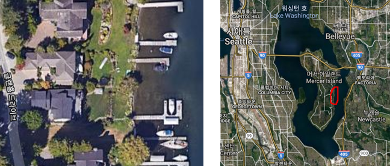

확인 결과, 해안뷰를 가진 주택은 대부분 해안가에 개인 선착장을 가진 주택이었다.

#### `zipcode`


```python
zipprice_med = pd.DataFrame(house.groupby('zipcode')['price'].median())
zipprice_med['code']=zipprice_med.index
zipprice_med = zipprice_med.sort_values(["price"], ascending=[False])
zipprice_med['rank'] = range(zipprice_med.shape[0])

zipprice_med.head()
```


<div>
<style scoped>
    .dataframe tbody tr th:only-of-type {
        vertical-align: middle;
    }

    .dataframe tbody tr th {
        vertical-align: top;
    }

    .dataframe thead th {
        text-align: right;
    }
</style>
<table border="1" class="dataframe">
  <thead>
    <tr style="text-align: right;">
      <th></th>
      <th>price</th>
      <th>code</th>
      <th>rank</th>
    </tr>
    <tr>
      <th>zipcode</th>
      <th></th>
      <th></th>
      <th></th>
    </tr>
  </thead>
  <tbody>
    <tr>
      <th>98039</th>
      <td>1895000.0</td>
      <td>98039</td>
      <td>0</td>
    </tr>
    <tr>
      <th>98004</th>
      <td>1150000.0</td>
      <td>98004</td>
      <td>1</td>
    </tr>
    <tr>
      <th>98040</th>
      <td>993750.0</td>
      <td>98040</td>
      <td>2</td>
    </tr>
    <tr>
      <th>98112</th>
      <td>915000.0</td>
      <td>98112</td>
      <td>3</td>
    </tr>
    <tr>
      <th>98005</th>
      <td>765475.0</td>
      <td>98005</td>
      <td>4</td>
    </tr>
  </tbody>
</table>
</div>


```python
sns.boxplot('price',data=zipprice_med)
```


    <matplotlib.axes._subplots.AxesSubplot at 0x26b65286358>


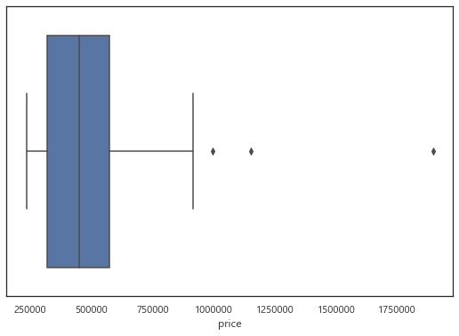


```python
zipmed_outlier = zipprice_med[abs(zipprice_med['price']-zipprice_med['price'].mean())>(3*zipprice_med['price'].std())]
zipmed_outlier
```


<div>
<style scoped>
    .dataframe tbody tr th:only-of-type {
        vertical-align: middle;
    }

    .dataframe tbody tr th {
        vertical-align: top;
    }

    .dataframe thead th {
        text-align: right;
    }
</style>
<table border="1" class="dataframe">
  <thead>
    <tr style="text-align: right;">
      <th></th>
      <th>price</th>
      <th>code</th>
      <th>rank</th>
    </tr>
    <tr>
      <th>zipcode</th>
      <th></th>
      <th></th>
      <th></th>
    </tr>
  </thead>
  <tbody>
    <tr>
      <th>98039</th>
      <td>1895000.0</td>
      <td>98039</td>
      <td>0</td>
    </tr>
  </tbody>
</table>
</div>


zipcode가 98039인 지역구의 집 거래가격이 다른 지역에 비해 두드러지게 높다.<br>
검색 결과, 해당 지역구는 부촌으로 알려진 도시 Medina이다.

### 변수간 상관관계

사용될 독립변수들끼리 서로 관계가 있으면 모델에 좋지 않은 영향을 끼칠 우려가 있다.


```python
features_corr = house.copy()
features_corr = features_corr.iloc[:,3:21]
features_corr = features_corr.corr()

sns.heatmap(features_corr)
```


    <matplotlib.axes._subplots.AxesSubplot at 0x26b64dfa160>


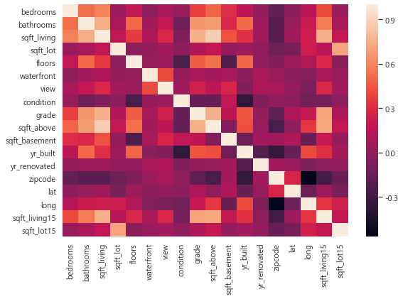


```python
features_corr[features_corr>=0.8]
```


<div>
<style scoped>
    .dataframe tbody tr th:only-of-type {
        vertical-align: middle;
    }

    .dataframe tbody tr th {
        vertical-align: top;
    }

    .dataframe thead th {
        text-align: right;
    }
</style>
<table border="1" class="dataframe">
  <thead>
    <tr style="text-align: right;">
      <th></th>
      <th>bedrooms</th>
      <th>bathrooms</th>
      <th>sqft_living</th>
      <th>sqft_lot</th>
      <th>floors</th>
      <th>waterfront</th>
      <th>view</th>
      <th>condition</th>
      <th>grade</th>
      <th>sqft_above</th>
      <th>sqft_basement</th>
      <th>yr_built</th>
      <th>yr_renovated</th>
      <th>zipcode</th>
      <th>lat</th>
      <th>long</th>
      <th>sqft_living15</th>
      <th>sqft_lot15</th>
    </tr>
  </thead>
  <tbody>
    <tr>
      <th>bedrooms</th>
      <td>1.0</td>
      <td>NaN</td>
      <td>NaN</td>
      <td>NaN</td>
      <td>NaN</td>
      <td>NaN</td>
      <td>NaN</td>
      <td>NaN</td>
      <td>NaN</td>
      <td>NaN</td>
      <td>NaN</td>
      <td>NaN</td>
      <td>NaN</td>
      <td>NaN</td>
      <td>NaN</td>
      <td>NaN</td>
      <td>NaN</td>
      <td>NaN</td>
    </tr>
    <tr>
      <th>bathrooms</th>
      <td>NaN</td>
      <td>1.0</td>
      <td>NaN</td>
      <td>NaN</td>
      <td>NaN</td>
      <td>NaN</td>
      <td>NaN</td>
      <td>NaN</td>
      <td>NaN</td>
      <td>NaN</td>
      <td>NaN</td>
      <td>NaN</td>
      <td>NaN</td>
      <td>NaN</td>
      <td>NaN</td>
      <td>NaN</td>
      <td>NaN</td>
      <td>NaN</td>
    </tr>
    <tr>
      <th>sqft_living</th>
      <td>NaN</td>
      <td>NaN</td>
      <td>1.000000</td>
      <td>NaN</td>
      <td>NaN</td>
      <td>NaN</td>
      <td>NaN</td>
      <td>NaN</td>
      <td>NaN</td>
      <td>0.876597</td>
      <td>NaN</td>
      <td>NaN</td>
      <td>NaN</td>
      <td>NaN</td>
      <td>NaN</td>
      <td>NaN</td>
      <td>NaN</td>
      <td>NaN</td>
    </tr>
    <tr>
      <th>sqft_lot</th>
      <td>NaN</td>
      <td>NaN</td>
      <td>NaN</td>
      <td>1.0</td>
      <td>NaN</td>
      <td>NaN</td>
      <td>NaN</td>
      <td>NaN</td>
      <td>NaN</td>
      <td>NaN</td>
      <td>NaN</td>
      <td>NaN</td>
      <td>NaN</td>
      <td>NaN</td>
      <td>NaN</td>
      <td>NaN</td>
      <td>NaN</td>
      <td>NaN</td>
    </tr>
    <tr>
      <th>floors</th>
      <td>NaN</td>
      <td>NaN</td>
      <td>NaN</td>
      <td>NaN</td>
      <td>1.0</td>
      <td>NaN</td>
      <td>NaN</td>
      <td>NaN</td>
      <td>NaN</td>
      <td>NaN</td>
      <td>NaN</td>
      <td>NaN</td>
      <td>NaN</td>
      <td>NaN</td>
      <td>NaN</td>
      <td>NaN</td>
      <td>NaN</td>
      <td>NaN</td>
    </tr>
    <tr>
      <th>waterfront</th>
      <td>NaN</td>
      <td>NaN</td>
      <td>NaN</td>
      <td>NaN</td>
      <td>NaN</td>
      <td>1.0</td>
      <td>NaN</td>
      <td>NaN</td>
      <td>NaN</td>
      <td>NaN</td>
      <td>NaN</td>
      <td>NaN</td>
      <td>NaN</td>
      <td>NaN</td>
      <td>NaN</td>
      <td>NaN</td>
      <td>NaN</td>
      <td>NaN</td>
    </tr>
    <tr>
      <th>view</th>
      <td>NaN</td>
      <td>NaN</td>
      <td>NaN</td>
      <td>NaN</td>
      <td>NaN</td>
      <td>NaN</td>
      <td>1.0</td>
      <td>NaN</td>
      <td>NaN</td>
      <td>NaN</td>
      <td>NaN</td>
      <td>NaN</td>
      <td>NaN</td>
      <td>NaN</td>
      <td>NaN</td>
      <td>NaN</td>
      <td>NaN</td>
      <td>NaN</td>
    </tr>
    <tr>
      <th>condition</th>
      <td>NaN</td>
      <td>NaN</td>
      <td>NaN</td>
      <td>NaN</td>
      <td>NaN</td>
      <td>NaN</td>
      <td>NaN</td>
      <td>1.0</td>
      <td>NaN</td>
      <td>NaN</td>
      <td>NaN</td>
      <td>NaN</td>
      <td>NaN</td>
      <td>NaN</td>
      <td>NaN</td>
      <td>NaN</td>
      <td>NaN</td>
      <td>NaN</td>
    </tr>
    <tr>
      <th>grade</th>
      <td>NaN</td>
      <td>NaN</td>
      <td>NaN</td>
      <td>NaN</td>
      <td>NaN</td>
      <td>NaN</td>
      <td>NaN</td>
      <td>NaN</td>
      <td>1.0</td>
      <td>NaN</td>
      <td>NaN</td>
      <td>NaN</td>
      <td>NaN</td>
      <td>NaN</td>
      <td>NaN</td>
      <td>NaN</td>
      <td>NaN</td>
      <td>NaN</td>
    </tr>
    <tr>
      <th>sqft_above</th>
      <td>NaN</td>
      <td>NaN</td>
      <td>0.876597</td>
      <td>NaN</td>
      <td>NaN</td>
      <td>NaN</td>
      <td>NaN</td>
      <td>NaN</td>
      <td>NaN</td>
      <td>1.000000</td>
      <td>NaN</td>
      <td>NaN</td>
      <td>NaN</td>
      <td>NaN</td>
      <td>NaN</td>
      <td>NaN</td>
      <td>NaN</td>
      <td>NaN</td>
    </tr>
    <tr>
      <th>sqft_basement</th>
      <td>NaN</td>
      <td>NaN</td>
      <td>NaN</td>
      <td>NaN</td>
      <td>NaN</td>
      <td>NaN</td>
      <td>NaN</td>
      <td>NaN</td>
      <td>NaN</td>
      <td>NaN</td>
      <td>1.0</td>
      <td>NaN</td>
      <td>NaN</td>
      <td>NaN</td>
      <td>NaN</td>
      <td>NaN</td>
      <td>NaN</td>
      <td>NaN</td>
    </tr>
    <tr>
      <th>yr_built</th>
      <td>NaN</td>
      <td>NaN</td>
      <td>NaN</td>
      <td>NaN</td>
      <td>NaN</td>
      <td>NaN</td>
      <td>NaN</td>
      <td>NaN</td>
      <td>NaN</td>
      <td>NaN</td>
      <td>NaN</td>
      <td>1.0</td>
      <td>NaN</td>
      <td>NaN</td>
      <td>NaN</td>
      <td>NaN</td>
      <td>NaN</td>
      <td>NaN</td>
    </tr>
    <tr>
      <th>yr_renovated</th>
      <td>NaN</td>
      <td>NaN</td>
      <td>NaN</td>
      <td>NaN</td>
      <td>NaN</td>
      <td>NaN</td>
      <td>NaN</td>
      <td>NaN</td>
      <td>NaN</td>
      <td>NaN</td>
      <td>NaN</td>
      <td>NaN</td>
      <td>1.0</td>
      <td>NaN</td>
      <td>NaN</td>
      <td>NaN</td>
      <td>NaN</td>
      <td>NaN</td>
    </tr>
    <tr>
      <th>zipcode</th>
      <td>NaN</td>
      <td>NaN</td>
      <td>NaN</td>
      <td>NaN</td>
      <td>NaN</td>
      <td>NaN</td>
      <td>NaN</td>
      <td>NaN</td>
      <td>NaN</td>
      <td>NaN</td>
      <td>NaN</td>
      <td>NaN</td>
      <td>NaN</td>
      <td>1.0</td>
      <td>NaN</td>
      <td>NaN</td>
      <td>NaN</td>
      <td>NaN</td>
    </tr>
    <tr>
      <th>lat</th>
      <td>NaN</td>
      <td>NaN</td>
      <td>NaN</td>
      <td>NaN</td>
      <td>NaN</td>
      <td>NaN</td>
      <td>NaN</td>
      <td>NaN</td>
      <td>NaN</td>
      <td>NaN</td>
      <td>NaN</td>
      <td>NaN</td>
      <td>NaN</td>
      <td>NaN</td>
      <td>1.0</td>
      <td>NaN</td>
      <td>NaN</td>
      <td>NaN</td>
    </tr>
    <tr>
      <th>long</th>
      <td>NaN</td>
      <td>NaN</td>
      <td>NaN</td>
      <td>NaN</td>
      <td>NaN</td>
      <td>NaN</td>
      <td>NaN</td>
      <td>NaN</td>
      <td>NaN</td>
      <td>NaN</td>
      <td>NaN</td>
      <td>NaN</td>
      <td>NaN</td>
      <td>NaN</td>
      <td>NaN</td>
      <td>1.0</td>
      <td>NaN</td>
      <td>NaN</td>
    </tr>
    <tr>
      <th>sqft_living15</th>
      <td>NaN</td>
      <td>NaN</td>
      <td>NaN</td>
      <td>NaN</td>
      <td>NaN</td>
      <td>NaN</td>
      <td>NaN</td>
      <td>NaN</td>
      <td>NaN</td>
      <td>NaN</td>
      <td>NaN</td>
      <td>NaN</td>
      <td>NaN</td>
      <td>NaN</td>
      <td>NaN</td>
      <td>NaN</td>
      <td>1.0</td>
      <td>NaN</td>
    </tr>
    <tr>
      <th>sqft_lot15</th>
      <td>NaN</td>
      <td>NaN</td>
      <td>NaN</td>
      <td>NaN</td>
      <td>NaN</td>
      <td>NaN</td>
      <td>NaN</td>
      <td>NaN</td>
      <td>NaN</td>
      <td>NaN</td>
      <td>NaN</td>
      <td>NaN</td>
      <td>NaN</td>
      <td>NaN</td>
      <td>NaN</td>
      <td>NaN</td>
      <td>NaN</td>
      <td>1.0</td>
    </tr>
  </tbody>
</table>
</div>


`sqft_living`(주택평수)와 `sqft_above`(주택지상평수)가 0.8 이상의 높은 상관계수를 갖는다.


```python
print(len(house))
print(len(house[house['sqft_living']==house['sqft_above']+house['sqft_basement']]))
```

    21612
    21612
    

확인 결과, 모든 자료에 대해 `sqft_living`(주택평수)는 `sqft_above`(주택지상평수)에 `sqft_basement`(주택지하평수)값을 더한 값이다.<br>
향후 선형회귀분석에서 다중공선성의 문제가 제기될 수 있다.
