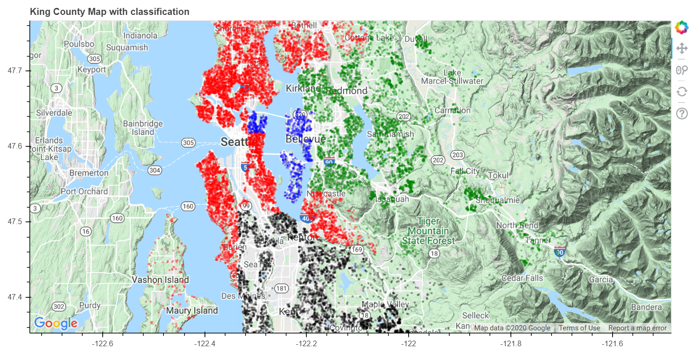

```python
import pandas as pd

data = pd.read_csv('kc_house_data.csv')
```


```python
pd.set_option("display.max_columns", None)
```


```python
data.head(3)
```

<div>
<table border="1" class="dataframe">
  <thead>
    <tr style="text-align: right;">
      <th></th>
      <th>id</th>
      <th>date</th>
      <th>price</th>
      <th>bedrooms</th>
      <th>bathrooms</th>
      <th>sqft_living</th>
      <th>sqft_lot</th>
      <th>floors</th>
      <th>waterfront</th>
      <th>view</th>
      <th>condition</th>
      <th>grade</th>
      <th>sqft_above</th>
      <th>sqft_basement</th>
      <th>yr_built</th>
      <th>yr_renovated</th>
      <th>zipcode</th>
      <th>lat</th>
      <th>long</th>
      <th>sqft_living15</th>
      <th>sqft_lot15</th>
    </tr>
  </thead>
  <tbody>
    <tr>
      <th>0</th>
      <td>7129300520</td>
      <td>20141013T000000</td>
      <td>221900.0</td>
      <td>3</td>
      <td>1.00</td>
      <td>1180</td>
      <td>5650</td>
      <td>1.0</td>
      <td>0</td>
      <td>0</td>
      <td>3</td>
      <td>7</td>
      <td>1180</td>
      <td>0</td>
      <td>1955</td>
      <td>0</td>
      <td>98178</td>
      <td>47.5112</td>
      <td>-122.257</td>
      <td>1340</td>
      <td>5650</td>
    </tr>
    <tr>
      <th>1</th>
      <td>6414100192</td>
      <td>20141209T000000</td>
      <td>538000.0</td>
      <td>3</td>
      <td>2.25</td>
      <td>2570</td>
      <td>7242</td>
      <td>2.0</td>
      <td>0</td>
      <td>0</td>
      <td>3</td>
      <td>7</td>
      <td>2170</td>
      <td>400</td>
      <td>1951</td>
      <td>1991</td>
      <td>98125</td>
      <td>47.7210</td>
      <td>-122.319</td>
      <td>1690</td>
      <td>7639</td>
    </tr>
    <tr>
      <th>2</th>
      <td>5631500400</td>
      <td>20150225T000000</td>
      <td>180000.0</td>
      <td>2</td>
      <td>1.00</td>
      <td>770</td>
      <td>10000</td>
      <td>1.0</td>
      <td>0</td>
      <td>0</td>
      <td>3</td>
      <td>6</td>
      <td>770</td>
      <td>0</td>
      <td>1933</td>
      <td>0</td>
      <td>98028</td>
      <td>47.7379</td>
      <td>-122.233</td>
      <td>2720</td>
      <td>8062</td>
    </tr>
  </tbody>
</table>
</div>


#### 지역코드별로 거래가의 중위값을 계산해 '지역별 중위 거래가'피쳐를 만들어줌


```python
zipprice = pd.DataFrame(data.groupby('zipcode')['price'].median())
zipprice['code']=zipprice.index
zipprice = zipprice.sort_values(["price"], ascending=False)
zipprice['rank'] = range(zipprice.shape[0])
```


#### 위에서 구한 우편번호별 중위값과 순위를 data에 mapping 해주자.

방법 : 
> 1. dictionary로 묶어준다.  
> 2. map을 사용한다.


```python
median_price = {i:j for j,i in zipprice.iloc[:,:2].values}
median_ranking = {i:j for i,j in zipprice.iloc[:,1:].values}
```


```python
list(median_price.items())[0:2], list(median_ranking.items())[0:2]
```


    ([(98039.0, 1895000.0), (98004.0, 1150000.0)], [(98039, 0), (98004, 1)])


```python
data['median_price'] =  data['zipcode'].map(median_price)
data['median_ranking'] = data['zipcode'].map(median_ranking)
```


```python
data.head(3)
```


<div>
<style scoped>
    .dataframe tbody tr th:only-of-type {
        vertical-align: middle;
    }

    .dataframe tbody tr th {
        vertical-align: top;
    }

    .dataframe thead th {
        text-align: right;
    }
</style>
<table border="1" class="dataframe">
  <thead>
    <tr style="text-align: right;">
      <th></th>
      <th>id</th>
      <th>date</th>
      <th>price</th>
      <th>bedrooms</th>
      <th>bathrooms</th>
      <th>sqft_living</th>
      <th>sqft_lot</th>
      <th>floors</th>
      <th>waterfront</th>
      <th>view</th>
      <th>condition</th>
      <th>grade</th>
      <th>sqft_above</th>
      <th>sqft_basement</th>
      <th>yr_built</th>
      <th>yr_renovated</th>
      <th>zipcode</th>
      <th>lat</th>
      <th>long</th>
      <th>sqft_living15</th>
      <th>sqft_lot15</th>
      <th>median_price</th>
      <th>median_ranking</th>
    </tr>
  </thead>
  <tbody>
    <tr>
      <th>0</th>
      <td>7129300520</td>
      <td>20141013T000000</td>
      <td>221900.0</td>
      <td>3</td>
      <td>1.00</td>
      <td>1180</td>
      <td>5650</td>
      <td>1.0</td>
      <td>0</td>
      <td>0</td>
      <td>3</td>
      <td>7</td>
      <td>1180</td>
      <td>0</td>
      <td>1955</td>
      <td>0</td>
      <td>98178</td>
      <td>47.5112</td>
      <td>-122.257</td>
      <td>1340</td>
      <td>5650</td>
      <td>278277.0</td>
      <td>60</td>
    </tr>
    <tr>
      <th>1</th>
      <td>6414100192</td>
      <td>20141209T000000</td>
      <td>538000.0</td>
      <td>3</td>
      <td>2.25</td>
      <td>2570</td>
      <td>7242</td>
      <td>2.0</td>
      <td>0</td>
      <td>0</td>
      <td>3</td>
      <td>7</td>
      <td>2170</td>
      <td>400</td>
      <td>1951</td>
      <td>1991</td>
      <td>98125</td>
      <td>47.7210</td>
      <td>-122.319</td>
      <td>1690</td>
      <td>7639</td>
      <td>425000.0</td>
      <td>38</td>
    </tr>
    <tr>
      <th>2</th>
      <td>5631500400</td>
      <td>20150225T000000</td>
      <td>180000.0</td>
      <td>2</td>
      <td>1.00</td>
      <td>770</td>
      <td>10000</td>
      <td>1.0</td>
      <td>0</td>
      <td>0</td>
      <td>3</td>
      <td>6</td>
      <td>770</td>
      <td>0</td>
      <td>1933</td>
      <td>0</td>
      <td>98028</td>
      <td>47.7379</td>
      <td>-122.233</td>
      <td>2720</td>
      <td>8062</td>
      <td>445000.0</td>
      <td>36</td>
    </tr>
  </tbody>
</table>
</div>


```python
data.shape
```


    (21613, 23)


***

### 클러스터링 인수설정


```python
기준컬럼 = ['lat','long','median_price']
clt = data[기준컬럼]
tmp = clt
```

> 근접한 동네인데도 충분히 빈부 격차가 크게 발생하는 곳도 더러 있으므로, 기준칼럼에 우편번호에 따른 중위 집가격을 추가했다.


```python
clt.head(3)
```


<div>
<style scoped>
    .dataframe tbody tr th:only-of-type {
        vertical-align: middle;
    }

    .dataframe tbody tr th {
        vertical-align: top;
    }

    .dataframe thead th {
        text-align: right;
    }
</style>
<table border="1" class="dataframe">
  <thead>
    <tr style="text-align: right;">
      <th></th>
      <th>lat</th>
      <th>long</th>
      <th>median_price</th>
    </tr>
  </thead>
  <tbody>
    <tr>
      <th>0</th>
      <td>47.5112</td>
      <td>-122.257</td>
      <td>278277.0</td>
    </tr>
    <tr>
      <th>1</th>
      <td>47.7210</td>
      <td>-122.319</td>
      <td>425000.0</td>
    </tr>
    <tr>
      <th>2</th>
      <td>47.7379</td>
      <td>-122.233</td>
      <td>445000.0</td>
    </tr>
  </tbody>
</table>
</div>


```python
from sklearn.preprocessing import scale
clt = pd.DataFrame(scale(clt), columns=clt.columns)
clt.head(3)
```


<div>
<style scoped>
    .dataframe tbody tr th:only-of-type {
        vertical-align: middle;
    }

    .dataframe tbody tr th {
        vertical-align: top;
    }

    .dataframe thead th {
        text-align: right;
    }
</style>
<table border="1" class="dataframe">
  <thead>
    <tr style="text-align: right;">
      <th></th>
      <th>lat</th>
      <th>long</th>
      <th>median_price</th>
    </tr>
  </thead>
  <tbody>
    <tr>
      <th>0</th>
      <td>-0.352572</td>
      <td>-0.306079</td>
      <td>-1.055402</td>
    </tr>
    <tr>
      <th>1</th>
      <td>1.161568</td>
      <td>-0.746341</td>
      <td>-0.309462</td>
    </tr>
    <tr>
      <th>2</th>
      <td>1.283537</td>
      <td>-0.135655</td>
      <td>-0.207782</td>
    </tr>
  </tbody>
</table>
</div>


> scaling은 기본이다.


```python
import numpy as np

컬럼당가중치 = [1,1,2]
clt_scale = pd.DataFrame(clt.values*np.array(컬럼당가중치) ,columns=기준컬럼)
```

> 오히려 우편번호에 따른 집 가격에 더 큰 가중치를 줌을 알 수 있다.


```python
clt_scale.head(3)
```


<div>
<style scoped>
    .dataframe tbody tr th:only-of-type {
        vertical-align: middle;
    }

    .dataframe tbody tr th {
        vertical-align: top;
    }

    .dataframe thead th {
        text-align: right;
    }
</style>
<table border="1" class="dataframe">
  <thead>
    <tr style="text-align: right;">
      <th></th>
      <th>lat</th>
      <th>long</th>
      <th>median_price</th>
    </tr>
  </thead>
  <tbody>
    <tr>
      <th>0</th>
      <td>-0.352572</td>
      <td>-0.306079</td>
      <td>-2.110803</td>
    </tr>
    <tr>
      <th>1</th>
      <td>1.161568</td>
      <td>-0.746341</td>
      <td>-0.618924</td>
    </tr>
    <tr>
      <th>2</th>
      <td>1.283537</td>
      <td>-0.135655</td>
      <td>-0.415563</td>
    </tr>
  </tbody>
</table>
</div>


***

## 클러스터링


```python
def clus(Type, num_of_cluster, X, eps=2):
    
    labels = []
    
    if Type =='분할기법' :
        from sklearn.cluster import KMeans
        kmeans = KMeans(n_clusters=num_of_cluster)
        kmeans.fit( X )
        labels = kmeans.labels_
        return labels
        
    elif Type == '계층기법' :
        from sklearn.cluster import AgglomerativeClustering
        agnes = AgglomerativeClustering(n_clusters=num_of_cluster)
        agnes.fit(X)
        labels = agnes.labels_
        return labels
        
    else :
        from sklearn.cluster import DBSCAN
        dbscan = DBSCAN(eps=eps*0.1)
        dbscan.fit(X)
        labels = dbscan.labels_
        return labels
```

## 1. KMeans 방법

임의로 스타팅 포인트를 잡아서 모든 변수들의 거리를 클러스터링 갯수만큼 분화시키고,  
평균 위치를 계산해서 위의 과정을 계속해서 반복해준다.

> https://www.youtube.com/watch?v=_aWzGGNrcic  
> https://www.youtube.com/watch?v=4b5d3muPQmA

## 2. AGGlomerative 방법

가장 가까운 거리의 두 점을 순서대로 찾아가는 과정

> https://datascienceschool.net/view-notebook/094bcb7b86574711a2e8d81f26bce2f5/  
> https://www.youtube.com/watch?v=XJ3194AmH40

## 3. DBScan 방법

모든 점에서 설정된 거리만큼 최대한 확장시켜서 나누는 것.

> https://www.youtube.com/watch?v=5E097ZLE9Sg

***


```python
labels = clus('계층기법', 4, clt_scale)
labels
```


    array([3, 0, 0, ..., 0, 1, 0], dtype=int64)


> 일반적으로 도시를 4개로 구분해서 4를 사용했다.


```python
labels.shape
```


    (21613,)


```python
data['labels'] = labels
data.head(3)
```


<div>
<style scoped>
    .dataframe tbody tr th:only-of-type {
        vertical-align: middle;
    }

    .dataframe tbody tr th {
        vertical-align: top;
    }

    .dataframe thead th {
        text-align: right;
    }
</style>
<table border="1" class="dataframe">
  <thead>
    <tr style="text-align: right;">
      <th></th>
      <th>id</th>
      <th>date</th>
      <th>price</th>
      <th>bedrooms</th>
      <th>bathrooms</th>
      <th>sqft_living</th>
      <th>sqft_lot</th>
      <th>floors</th>
      <th>waterfront</th>
      <th>view</th>
      <th>condition</th>
      <th>grade</th>
      <th>sqft_above</th>
      <th>sqft_basement</th>
      <th>yr_built</th>
      <th>yr_renovated</th>
      <th>zipcode</th>
      <th>lat</th>
      <th>long</th>
      <th>sqft_living15</th>
      <th>sqft_lot15</th>
      <th>median_price</th>
      <th>median_ranking</th>
      <th>labels</th>
    </tr>
  </thead>
  <tbody>
    <tr>
      <th>0</th>
      <td>7129300520</td>
      <td>20141013T000000</td>
      <td>221900.0</td>
      <td>3</td>
      <td>1.00</td>
      <td>1180</td>
      <td>5650</td>
      <td>1.0</td>
      <td>0</td>
      <td>0</td>
      <td>3</td>
      <td>7</td>
      <td>1180</td>
      <td>0</td>
      <td>1955</td>
      <td>0</td>
      <td>98178</td>
      <td>47.5112</td>
      <td>-122.257</td>
      <td>1340</td>
      <td>5650</td>
      <td>278277.0</td>
      <td>60</td>
      <td>3</td>
    </tr>
    <tr>
      <th>1</th>
      <td>6414100192</td>
      <td>20141209T000000</td>
      <td>538000.0</td>
      <td>3</td>
      <td>2.25</td>
      <td>2570</td>
      <td>7242</td>
      <td>2.0</td>
      <td>0</td>
      <td>0</td>
      <td>3</td>
      <td>7</td>
      <td>2170</td>
      <td>400</td>
      <td>1951</td>
      <td>1991</td>
      <td>98125</td>
      <td>47.7210</td>
      <td>-122.319</td>
      <td>1690</td>
      <td>7639</td>
      <td>425000.0</td>
      <td>38</td>
      <td>0</td>
    </tr>
    <tr>
      <th>2</th>
      <td>5631500400</td>
      <td>20150225T000000</td>
      <td>180000.0</td>
      <td>2</td>
      <td>1.00</td>
      <td>770</td>
      <td>10000</td>
      <td>1.0</td>
      <td>0</td>
      <td>0</td>
      <td>3</td>
      <td>6</td>
      <td>770</td>
      <td>0</td>
      <td>1933</td>
      <td>0</td>
      <td>98028</td>
      <td>47.7379</td>
      <td>-122.233</td>
      <td>2720</td>
      <td>8062</td>
      <td>445000.0</td>
      <td>36</td>
      <td>0</td>
    </tr>
  </tbody>
</table>
</div>


***

# 결과분석


```python
data.groupby('labels')['price'].median()
```


    labels
    0     465000.0
    1     602000.0
    2    1050000.0
    3     285000.0
    Name: price, dtype: float64


0번 클러스터는 Seattle 지역\
1번 클러스터는 Bellevue 를 위시한 시애틀의 배드타운\
2번 클러스터는 Medina와 그 주변의 시애틀 최대의 부촌 지역\
3번 클러스터는 공업도시 타코마 인근의 평범한 거주지역

***

## 시각화


```python
from bokeh.io import output_file, show
from bokeh.models import ColumnDataSource, GMapOptions
from bokeh.plotting import gmap
```


```python
map_options = GMapOptions(lat=data.lat.mean(), lng=data.long.mean()+0.1, map_type="terrain", zoom=10)

p = gmap(key, map_options, title="King County Map with classification")
p.plot_height = 500
p.plot_width = 980

dot1 = p.circle(x="long", y="lat", size=3, fill_color='red', fill_alpha=0.2, source=data[data['labels']==0], line_width = 0)
dot2 = p.circle(x="long", y="lat", size=3, fill_color='green', fill_alpha=0.2, source=data[data['labels']==1], line_width = 0)
dot3 = p.circle(x="long", y="lat", size=3, fill_color='blue', fill_alpha=0.2, source=data[data['labels']==2], line_width = 0)
dot4 = p.circle(x="long", y="lat", size=3, fill_color='black', fill_alpha=0.2, source=data[data['labels']==3], line_width = 0)

p.add_layout(dot1)
p.add_layout(dot2)
p.add_layout(dot3)
p.add_layout(dot4)

output_file("King_county_classification.html")
show(p)
```


